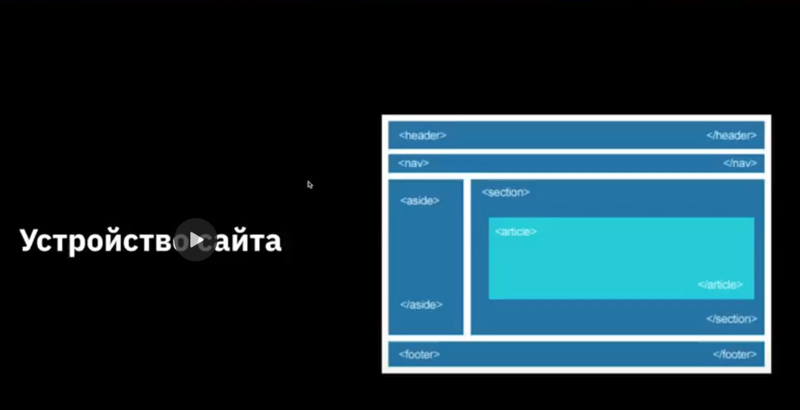
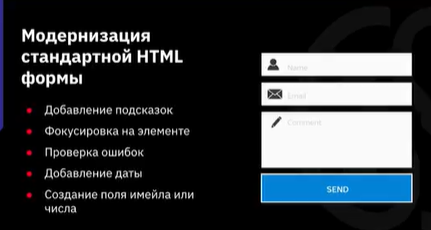

# Новые возможности в HTML5
### План урока
1. Новые семантические элементы
2. Модерация стандартной html формы
3. Добавление аудио и видео на страницу

## Новые семантические элементы
#### Новый способ структурирования страниц
## Для чего необходим новый способ структурирования страниц?
1. Более удобное редактирование и сопровождение
2. оптимизация поисковых движков
3. Поддержка будущих возможностей
### Семантические элементы для работы со структурой страниц 
## `<header>` 
Шапка сайта или раздела, в которой может распологаться одие или несколько заголовков, группа навигационных цепочек, информация об авторе.

## `<nav>`
Группа навигационных цепочек (меню сайта).
## `<main>`
Основное, уникальное для каждой страницы, содержимое сайта.
## `<footer>`
Подвал сайта или раздела, где может содержаться информация об авторе, навигационная цепочка или контактная информация.
## `<section>`
логическая область страницы, применяется для новостей, блоков информации. Раздел чаще всего содержит заголовок.
## `<article>`
раздел контента, который образует независимую часть документа или сайта, например, статья в журнале, запись в блоге, комментарий.
## `<aside>`
Контент страницы. который можно убрать со страницы без потери смысла для сайта.
## `<figure>` 
Тег-контейнер для иллюстрации или диаграммы, обычно с подписью `<figcaption>`
## `
`
Виджет, которй пользователь может открыть или закрыть.
## `
`
В этот тег заключается текст, который необходимо скрыть.

# Семантические элементы для работы с текстом
## `<time>`
определяет дату, время, например для выделения даты создания статьи или контента, регистрации на сайте.
## `<wbr>`
Место разрыва длинной строки.
# Усовершенствование традиционных форм

# HTML5 аудио и видео
## Аудио HTML5
HTML5-элемент `<audio>` используется для внедрения звукового контента в веб-страницы.
# controls
Добавляет отображение браузерами интерфейса управления аудио плеера - кнопки воспроизведения, паузы, громкости
## autoplay
Авьтоматически запускает на странице аудио файл.

## loop 
При завершении композиции она запустится вновь.

## muted 
Отключает звук.
## preload
Какую часть аудио-файла требуется загрузить браузеры для ускорения запуска аудиозаписи