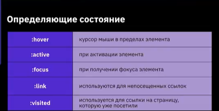
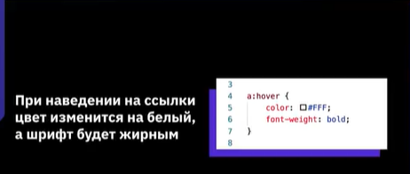
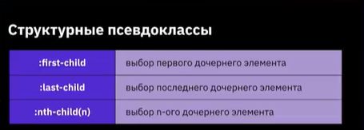
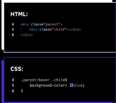
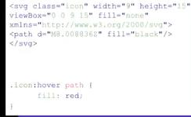

# Основы CSS
## План урока
1. Псевдоклассы и псевдоэлементы
2. Работа с svg
3. Эффекты перехода
4. эффекты трансформации
5. Эффекты анимации
# Псевдоклассы и псевдоэлементы
## Псевдоклассы
**Псевдоклассы** - это атрибуты, назначаемые строго к селекторам с намерением определить реакцию или состояние для данного селектора.




## Добавление стилей к дочерним элементам


```
При наведении на блок с классом <<parent>> у дочернего элемента с классом <<child>> цвет фона изменится на синий.
```
## Комбинирование псевдо-классов
При наведении на не посещенную ссылку цвет текста будет зеленым.
```
a:link:hover {
    colore:#0F0;
}
```
## Псевдоэлементы
```
:after - добавляет контент после содержимого элемента
:before - добавляет контент до содержимого элемента
:first-letter - определяет стиль первого символа в тексте
:first-line - определяет стиль первой строки блочного текста
```
 * Пример добавления псевдоэлемента after
 ```
 li:after{
    content: "new";
    color:#F00
 }
```
# Использование формата графики SVG
### Преимущества SVG
* При масштабировании SVG не теряет в качестве, увеличивается скорость загрузки сайта из-за уменьшение HTTP-запросов.

* При использовании CSS можно менять параметры графики на сайте, например, фон, прозрачность или границы.

* С использованием javascript можно анимировать SVG.

* Минимальный размер файла формата SVG.

### Добавление SVG на сайт

* Использование тега ``
Примеи: ``

* Использование тега `<object>`
Пример: `<object type="image/svg+xml" data="image.svg"></object>`

* Использование тега `<iframe>` `<iframe src="SvgImg.svg"></iframe>`

* Использование встраиваемого `<svg>`

* Добавление с использованием css свойства background-image

## Как добавить наведения на svg изображение




# Эффекты перехода
## Свойство transition
### Особенности transition

* переходы осуществляют плавные переходы при смене одного значения свойства на другое.

* Часто используется для стилизации эффектов наведения или активации элемента.

* также дают возможность контролировать плавность изменения css-свойств при анимации элементов.

**Transition-property**

название свойства, к которому будет применяться эффект трансформации.

**Transition-duration**

промежуток времени, за которое происходит изменение элемента.

**Transition-timing-function**

Функция, определяющая скорость перехода объекта из одного состояния в другое.

**Transition-delay**

Изменение происходит не сразу, а по истечении времени(необязательное свойство).

