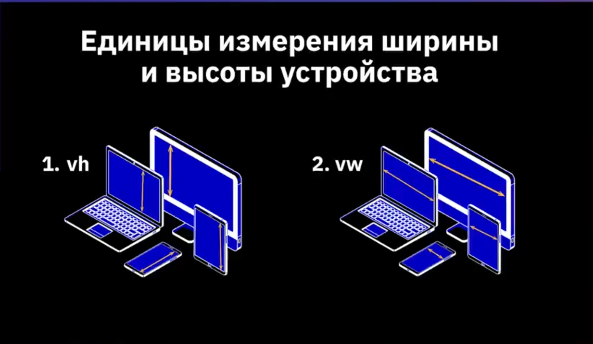

## План урока
1. Понятие адаптивного сайта
2. Эмуляция мобильных устройств в браузере
3. Новые параметры ширины и высоты
4. Единицы измерения ширины и высоты устройства
5. Медиа-запросы
## Что такое адаптивный сайт?
Адаптивный сайт - это когда идет перестроение блоков.
Вторая составляющая у адаптивного сайта - это адаптивный макет
## Новые параметры ширины и высоты
max-width  максимальное значение ширины

min-width минимальное значение ширины

max-height  максимальное значение высоты

min-height  минимальное значение высоты

% процентное значение

# Медиа-запрсоы
## Что такое медиа-запросы
**Медиа-запросы** - фильтры, которые можно применять к стилям CSS, позволяющие изменять стили на основании характеристик устройства.

1. Разрешение экрана.
2. Ширина.
3. высота.
4. Ориентация экрана.

### Часто используемые медиа-запросы
min-width ширина больше значения, указанного в запросе

max-width ширина меньше значения, указанного в запросе

min-height высота больше значения, указанного в запросе

max-height высота меньше значения, указанного в запросе

orientation=portrait высота не меньше ширины

orientation=landscape ширина больше высоты

## Условия для Media Queiries
1. @media(max-width: XXXpx){}
2. @media(min-width: XXXpx){}
3. @media(min-width: XXXpx) and (max-width: YYYpx)
4. @media(max-device-width XXXpx)

